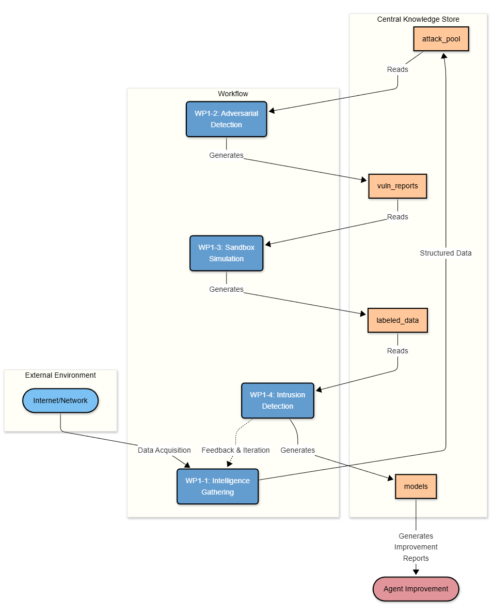

# 基于多智能体的 AI 系统态势感知与自动化防御系统

## 系统定位

通过构建一套**自我感知、学习、规划、执行**的智能体群，解决各类 AI 系统（包括大模型、小模型、AI OS、AI 应用等）所面临的各类安全挑战，涵盖**网络安全**与**功能安全**。

**第一阶段**主攻大模型的安全问题（提示词注入、模型越狱等网络安全相关问题）；未来将逐步开发各类子系统与智能体，解决更广泛的安全问题。

四个智能体模块 (WP1-1 ~ WP1-4) 协同工作，形成完整的 **攻防一体化安全闭环** — 不仅自动发现和验证漏洞，还能自动生成防御能力（检测模型），持续进化。

## 核心架构

<!--  -->

| 智能体 | 编号 | 角色定位 | 所属层次 |
|--------|------|----------|----------|
| **情报采集智能体** | WP1-1 | 威胁发现者 | 通用层 |
| **渗透测试智能体** | WP1-2 | 测试方案生成者 | 通用层 |
| **沙盒模拟智能体** | WP1-3 | 测试执行与数据采集者 | 用户层 |
| **入侵检测智能体** | WP1-4 | 防御建设者 | 用户层 |

### 通用层与用户层

系统明确划分为两个层次：

**通用层（与用户应用无关，持续运行）**

WP1-1 和 WP1-2 独立运行，不依赖任何用户的具体应用。它们持续积累威胁情报、测试方案和脚本，类似于"弹药工厂"。

**用户层（与用户应用绑定）**

WP1-3 和 WP1-4 在用户接入系统后才开始工作。WP1-3 接入用户应用、解析其 AI BOM、与通用层的情报库匹配后筛选出相关威胁，然后执行测试并采集数据；WP1-4 基于采集的数据为用户训练定制化检测模型。

```
通用层（持续运行，与用户无关）
┌────────────────────────────────────────────────────────────┐
│                                                            │
│  WP1-1 情报采集              WP1-2 渗透测试                 │
│  ┌───────────────────┐      ┌───────────────────┐         │
│  │ 采集威胁情报        │      │ 针对情报生成        │         │
│  │ 标注影响的          │─────→│ 通用测试方案 + 脚本  │         │
│  │ AI BOM 组件/版本    │      │ (代码、语料库)      │         │
│  │ 推荐处置方案        │      │                   │         │
│  └───────────────────┘      └───────────────────┘         │
│                                                            │
│  产出：威胁情报库             产出：测试方案库                 │
│       AI BOM 组件知识库             测试脚本库               │
│       推荐处置方案                                          │
└────────────────────────────────────────────────────────────┘
                               │
                               ▼
用户层（用户接入后启动）
┌────────────────────────────────────────────────────────────┐
│                                                            │
│  WP1-3 沙盒模拟                                            │
│  ┌──────────────────────────────────────────────┐         │
│  │ 1. 接入用户系统，虚拟化克隆                      │         │
│  │ 2. 解析用户系统的 AI BOM                        │         │
│  │ 3. 将用户 AI BOM 与情报库匹配 → 筛选相关威胁/脚本 │         │
│  │ 4. 在沙盒中执行测试                             │         │
│  │ 5. 采集测试数据（流量/日志/交互记录）              │         │
│  └──────────────────────────────────────────────┘         │
│                               │                            │
│                               ▼                            │
│  WP1-4 入侵检测                                            │
│  ┌──────────────────────────────────────────────┐         │
│  │ 基于采集的异常/正常数据训练检测模型               │         │
│  │ (借助 ADBench 等工具自动选择最优算法)             │         │
│  │ 模型优化可结合沙盒模拟智能体进行迭代              │         │
│  └──────────────────────────────────────────────┘         │
└────────────────────────────────────────────────────────────┘
```

### 核心设计原则

1. **通用层与用户层分离** — WP1-1/WP1-2 持续积累通用安全知识，不依赖用户；WP1-3/WP1-4 在用户接入后匹配并执行
2. **系统层用 Pipeline + Event-Driven, 子系统内部各自选择最合适的 Agent 架构**
3. **智能体之间通过中央知识库解耦, 而非直接 Handoff** — 各子系统运行时间跨度差异巨大, 且需要独立运行/调试
4. **渐进式复杂度** — 先用文件系统 + JSON 跑通, 再演进为数据库 + 向量存储
5. **攻防一体闭环** — 蓝队防御结果反馈回红队, 驱动下一轮攻击进化


## 技术架构分层

| 层级 | 组成 |
|------|------|
| **应用层** | 四个智能体 (WP1-1 ~ WP1-4) + 安全运营智能助手 |
| **模型层** | 大语言模型 (攻击生成/评估)、多模态模型、向量模型、搜索引擎 |
| **数据层** | 数据采集、预处理、向量化、知识库 (知识问答、报警根因分析) |
| **中间层** | 资源管理 (Docker 容器/虚拟化)、AI 工具 (Dify)、安全模块 |
| **基础设施** | 计算 (CPU/GPU)、存储 (HBM/NVMe)、网络 (IB/RoCE) |


## 4 个子系统的详细设计

### 子系统 1: 情报采集智能体 (WP1-1)

**所属层次**: 通用层

**核心任务**: 监控各类主流 AI 系统，自动化采集、分析各类安全威胁情报，标注受影响的 AI BOM 组件

**内部架构**: Supervisor

选择 Supervisor 是因为爬取目标是动态的, 需要 Supervisor 根据当前攻击池的覆盖情况决定"接下来去哪里找什么类型的攻击"。


**数据来源**:

| 来源 | 采集内容 |
|------|---------|
| **公开漏洞库** (CVE、NVD、MITRE ATT&CK) | 已知 AI 系统相关 CVE、ATT&CK 战术映射 |
| **技术社区** (GitHub Security、HuggingFace、arXiv) | PoC 代码、安全论文、模型卡中的安全声明 |
| **暗网数据** (论坛、Telegram 群组) | 地下攻击工具、泄露的攻击手法 |
| **第三方情报 API** (VirusTotal、AlienVault 等) | 结构化威胁指标 (IoC)、关联分析 |

**内部 Agent 说明**:

| Agent | 职责 | 工具 |
|-------|------|------|
| **Intel Supervisor** | 分析攻击池覆盖率 (按 OWASP LLM Top 10 分类), 决定优先采集方向 | 知识库查询, 覆盖率统计 |
| **Web Crawler Agent** | 爬取公开漏洞库、技术社区、安全博客 | httpx, BeautifulSoup, GitHub API, HuggingFace API |
| **Paper Analyzer Agent** | 解析学术论文和安全报告, 提取攻击方法与 PoC | PDF 解析, LLM 摘要提取 |
| **Dark Web Agent** | 采集暗网论坛和 Telegram 群组中的攻击情报 | Tor 代理, Telegram Bot API |
| **Standardizer Agent** | 将原始情报标准化为 **STIX 2.1 兼容** 的 attack_pool schema, 去重, 标注受影响的 AI BOM 组件 | JSON Schema 验证, 相似度检测, STIX 序列化 |

**产出**:
- **安全威胁情报库**：`attack_pool/` 目录下的标准化攻击条目 (STIX 2.1 兼容 JSON)，每条标注受影响的 AI BOM 组件类型与版本
- **AI BOM 通用组件知识库**：主流 AI 模型、框架、工具的组件信息与已知风险（类似 SBOM，用于后续与用户系统匹配）
- **推荐处置方案**：基于公开安全建议和最佳实践的防御性建议（告诉你怎么修）
- 实时告警 (高危新攻击技术发现时)
- 可操作的测试用例 (直接可被 WP1-2 消费)

---

### 子系统 2: 渗透测试智能体 (WP1-2)

**所属层次**: 通用层

**核心任务**: 针对 WP1-1 输出的安全威胁情报，借助大模型及"本体+知识图谱"技术，自动生成通用测试方案和测试脚本（代码、语料库等）

**注意**: WP1-2 **仅负责生成**测试方案与脚本，不负责执行测试。实际测试执行在 WP1-3 沙盒中进行。

**内部架构**: Supervisor

- Orchestrator 需要从 attack_pool **按策略选择** 攻击任务, 而非让 Agent 自行决定
- 攻击覆盖率 (OWASP LLM Top 10) 需要 Orchestrator 统一追踪

<!--  -->

**关键能力**:

| 能力 | 说明 |
|------|------|
| **基于本体+知识图谱生成测试方案** | 利用 AI 安全知识图谱理解攻击模式间的关联，生成系统化的测试方案 |
| **基于模板生成测试脚本** | 参照 OWASP LLM Top 10 分类, 从 attack_pool 读取模板并实例化为可执行脚本 |
| **攻击向量库管理** | 提示注入、数据泄露、拒绝服务、越狱、Agent 劫持等 |
| **多模态测试支持** | 文本、图像、音频三种模态的攻击脚本生成 |
| **预估 CVSS 评分** | 基于情报信息对威胁进行理论评分（最终验证在 WP1-3 执行后确定） |

**内部 Agent 说明**:

| Agent | 职责 | 工具 |
|-------|------|------|
| **Red Team Orchestrator** | 从 attack_pool 选择攻击、分派生成任务、追踪 OWASP Top 10 覆盖率 | 知识库读取, 知识图谱查询, 任务调度 |
| **Prompt Injection Agent** | 生成直接/间接提示词注入攻击脚本 | Payload 模板库, 变异引擎 |
| **Jailbreak Agent** | 生成越狱攻击脚本 (DAN、角色扮演、编码绕过、token 走私) | 越狱模板库, 变异引擎 |
| **Info Leakage Agent** | 生成系统提示词泄露、训练数据泄露、RAG 数据源泄露的探测脚本 | 探测 Prompt 库 |
| **Multimodal Attack Agent** | 生成图像对抗样本、音频攻击、跨模态注入脚本 | 图像处理库, 音频处理库 |

**产出**:
- **测试方案库**：针对各类威胁的系统化测试方案
- **测试脚本库**：可执行的攻击脚本包（代码、语料库等），存入 `test_scripts/` 目录
- 预估 CVSS 评分（理论评分，供 WP1-3 参考）

---

### 子系统 3: 沙盒模拟智能体 (WP1-3)

**所属层次**: 用户层（用户接入后启动）

**核心任务**: 采用类仿真技术，将用户的系统（包括硬件环境、底软、中间件、OS、各类应用）进行虚拟化克隆，在沙盒中执行测试并自动采集各类实验数据

WP1-3 是用户系统的唯一接入点。它在克隆用户系统时解析其 AI BOM，然后与 WP1-1 的情报库进行匹配，筛选出与该用户相关的威胁和测试脚本后执行。

**核心功能**:

1. **用户系统虚拟化克隆**：将用户的完整系统栈（硬件环境、底软、中间件、OS、各类应用）进行虚拟化克隆搭建
2. **AI BOM 解析与匹配**：解析用户系统的 AI BOM，与 WP1-1 情报库中的组件信息匹配，确定该系统面临的具体威胁
3. **测试执行**：从 WP1-2 的测试脚本库中筛选匹配的脚本，在沙盒中安全执行
4. **数据采集与标记**：自动采集各类测试实验数据（网络流量、系统日志、应用日志、模型交互记录等），并自动标记
5. **漏洞验证与评分**：在实际执行测试后确认漏洞存在性，给出最终 CVSS 评分

**产出**:
- 模拟执行报告
- 标记后的异常数据集（网络流量 PCAP、系统日志、模型交互记录、性能指标时序数据、安全事件记录）
- 漏洞验证报告（含最终 CVSS 评分）
- 取证数据包

---

### 子系统 4: 入侵检测智能体 (WP1-4)

**所属层次**: 用户层（基于 WP1-3 的数据训练）

**核心任务**: 将 WP1-3 采集到的各类异常和正常数据进行训练学习，借助 ADBench 等工具自动选择最优模型，生成检测算法模型

模型的优化可以结合沙盒模拟智能体进行迭代：在沙盒中验证模型效果，反馈结果后重新调优。

**核心功能**:

1. **数据预处理引擎**：多源数据融合与特征工程自动化、数据标准化、数据集自动划分
2. **智能模型选择系统**：模型候选池（随机森林、XGBoost、CNN、Transformer、ResNet、Deeplog、LogAnomaly 等），借助 ADBench 自动推荐最优模型
3. **模型训练与优化**：异常检测模型（监督/半监督）、GAN 对抗训练、超参数自动优化（贝叶斯/遗传算法）、增量学习
4. **与沙盒联动优化**：将训练好的模型部署到 WP1-3 沙盒中验证效果，基于验证结果迭代优化

**产出**:
- 训练完成的模型文件（异常检测模型、GAN 模型组件、特征处理器，支持 ONNX/TF/PyTorch 格式）
- 模型评估报告（性能指标、混淆矩阵、误报/漏报分析、与基线模型的对比实验结果）
